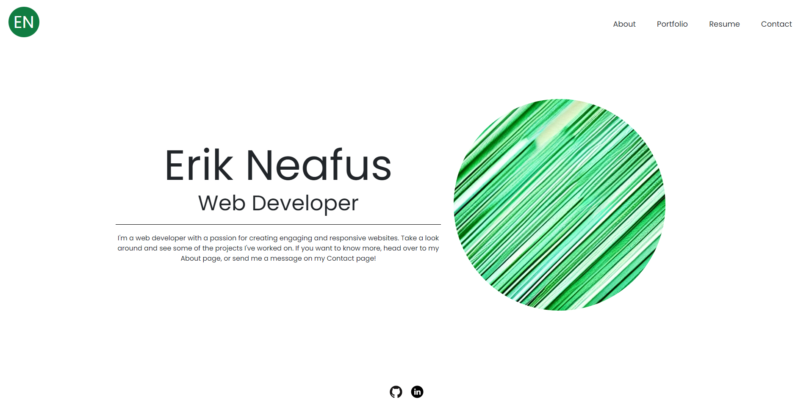

# React Portfolio

## Description

This is a personal portfolio website created using react.

It functions as expected: click the nav bar to move around the website, click the logo to return to the homepage, and click the footer icons to go to my profile on the corresponding website.

On the 'contact' page, there is a form that can be used to contact me. If you click into a field, and then click out of it without entering anything, text will pop up reminding you to fill that field in.

The form is functional, so if you hit submit, I will get your message!

[This is a link to the working webpage](https://erik814.github.io/react-portfolio/)

Here is a screenshot of the webpage:

